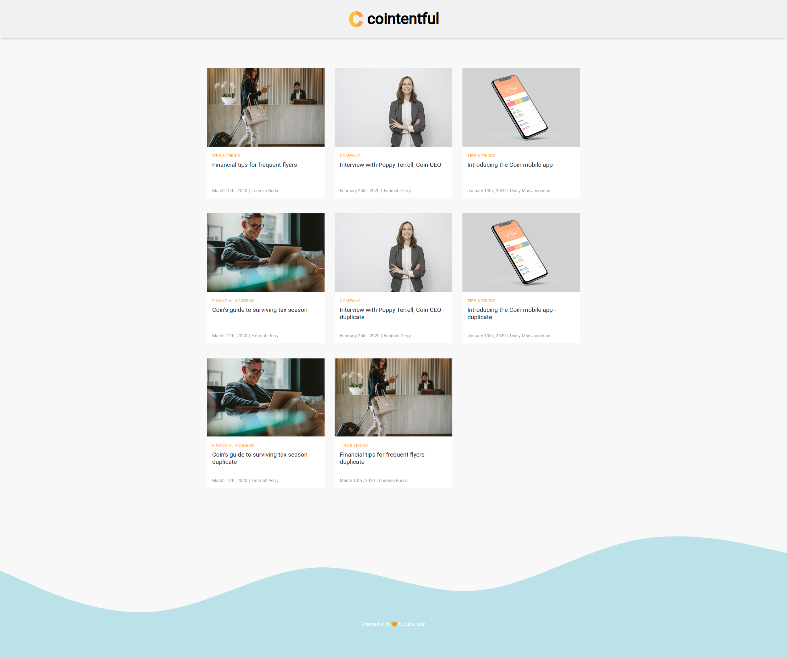
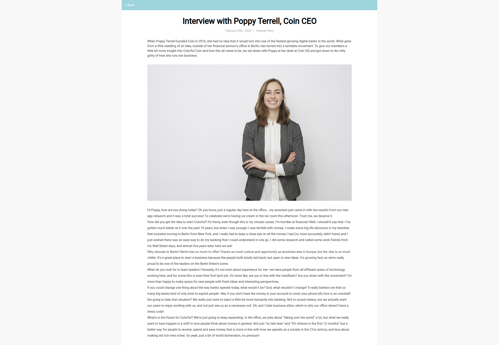

# cointentful

**Cointentful** is a blog site **powered by Contenful** and **bootstrapped with Create React App**.

The design inspiration came from the Contentful blog site itself. 🧡

The project has been **deployed to Netlify** and you can check it out [here](https://cointentful.netlify.app/).

## 🏗️ How to run project locally

1. Run `git clone git@github.com:lara-isak/cointentful.git && cd cointentful/` in your terminal to clone the repo from Github and change from the current to the newly cloned directory

2. Run `npm install` command to install all the necessary modules

3. Modify the **.env_sample file** following the simple instructions provided in the file itself

4. Finally run `npm start` and open [http://localhost:3000](http://localhost:3000) to view the app in the browser

## 🌱 What I learned

I really enjoyed working on this project and I learned a lot while doing it.

:arrow_right: how to work with **Contenful Delivery API** to fetch the data and render it  
:arrow_right: how to utilize **useParams hook** from **React Router** to access the dynamic pieces of the URL 
:arrow_right: how to use **custom hooks** to extract some components logic into a reusable functions 
:arrow_right: how to apply BEM methodolgy in a project (just for fun since I haven't used it before and I'm always happy to learn something new)

